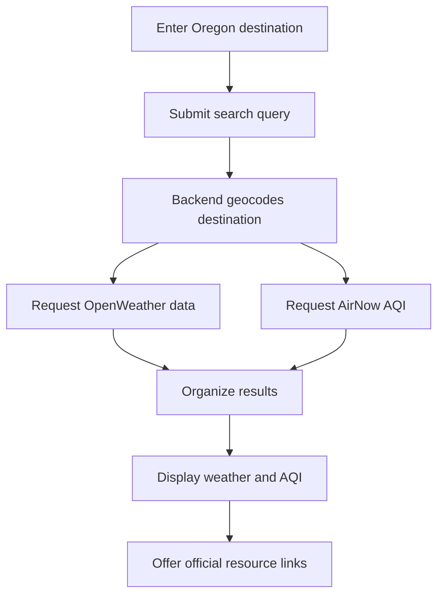

# Oregon Trip Ready

> A one-stop starting point for checking conditions before traveling to an Oregon destination.

---

## Table of Contents

- [Vision](#vision)
- [Project Scope](#project-scope)
- [Minimum Viable Product](#minimum-viable-product)
- [User Stories](#user-stories)
- [Functional Requirements](#functional-requirements)
- [Application Data Flow](#application-data-flow)
- [External Data Sources](#external-data-sources)
- [Stretch Goals](#stretch-goals)
- [Non-Functional Requirements](#non-functional-requirements)
- [Security](#security)
- [Limitations and Disclaimer](#limitations-and-disclaimer)

---

## Vision

Oregon Trip Ready is a one-stop starting point for checking conditions before traveling to an Oregon destination. A user can search for a location and view current weather and air-quality information in one dashboard.

The application addresses the inconvenience of searching several unrelated websites before a trip. It also provides quick links to official resources for wildfire smoke, road conditions, cameras, weather alerts, avalanche forecasts, and earthquakes.

## Project Scope

### Included

Oregon Trip Ready will:

- Allow users to search for an Oregon destination.
- Display current weather from the OpenWeather API.
- Display current Air Quality Index information from the AirNow API.
- Present weather and air quality in separate, readable panels.
- Provide clear loading, no-data, and error messages.
- Use a responsive, mobile-first React interface.
- Follow basic web accessibility practices.

### Not Included

The MVP will not:

- Decide whether a user should travel.
- Replace official emergency warnings or instructions.
- Require authentication or user accounts.
- Save trips or personal information.
- Use MongoDB or CRUD functionality.
- Include an AI assistant or chatbot.

## Minimum Viable Product

The MVP allows a user to enter an Oregon destination in a search bar. The frontend sends the destination to the backend as a search query. The backend locates the destination and retrieves current weather and AQI information. The frontend then displays the results in separate condition panels.

### MVP Features

- [ ] Oregon destination search
- [ ] Current weather results
- [ ] Current AQI results
- [ ] Loading indicator
- [ ] Invalid-location message
- [ ] API and unavailable-data messages
- [ ] Responsive results display
- [ ] Accessible form controls and results

## User Stories

### 1. Search for an Oregon Destination

> As a traveler, I want to search for an Oregon destination so that I can quickly check conditions before leaving.

### 2. View Current Weather

> As a traveler, I want to see current weather at my destination so that I can prepare for expected conditions.

### 3. View Current Air Quality

> As a traveler, I want to see current air quality at my destination so that I can decide what health precautions to take.

## Functional Requirements

### Destination Search

The application must:

- Accept an Oregon destination through a search form.
- Prevent an empty search from being submitted.
- Send the destination to the backend as a search query.
- Convert the destination into geographic coordinates.
- Display a useful error if the destination cannot be found.

### Weather Conditions

The application must:

- Request current weather for the destination.
- Display the destination name, temperature, and weather description.
- Display other available conditions, such as wind or precipitation.
- Display an error if weather data cannot be retrieved.

### Air Quality

The application must:

- Request AQI data using the destination coordinates.
- Display the current AQI number and category.
- Communicate the AQI category with text instead of color alone.
- Display a message when AQI data is unavailable.

## Application Data Flow

1. The user enters an Oregon destination.
2. The frontend sends the destination to the backend as a search query.
3. The backend converts the destination into latitude and longitude.
4. The backend requests weather data from OpenWeather.
5. The backend requests AQI data from AirNow.
6. The backend organizes the returned information.
7. The backend sends the combined results to the frontend.
8. The frontend displays the weather and AQI panels.
9. The user may open an official external resource for additional information.

### Workflow Diagram

## External Data Sources

| Source | Information | Project Use |
|---|---|---|
| OpenWeather API | Current weather | MVP API |
| AirNow API | Current U.S. AQI | MVP API |
| [AirNow Fire and Smoke Map](https://fire.airnow.gov/) | Fires, smoke plumes and PM2.5 | External stretch link |
| [TripCheck](https://tripcheck.com/) | Road conditions, incidents and cameras | External stretch link |
| [NWS Hazards Viewer](https://www.weather.gov/wrh/hazards) | Weather warnings and hazard maps | External stretch link |
| [Oregon Avalanche Forecasts](https://www.weather.gov/pdt/AvalancheWeather) | Regional avalanche information | External stretch link |
| [USGS Latest Earthquakes](https://earthquake.usgs.gov/earthquakes/map/) | Recent seismic activity | External stretch link |

## Stretch Goals

If time permits, the application will provide accessible icon links to the external resources listed above. These links will:

- Use visible, descriptive text instead of relying on an icon alone.
- Be accessible by keyboard.
- Open the official resource in a new browser tab.
- Leave the Oregon Trip Ready application open.

The external websites' data will not be processed by Oregon Trip Ready during the MVP.

## Non-Functional Requirements

### Accessibility

The application will use semantic HTML, associated form labels, keyboard-accessible controls, and descriptive link text. AQI conditions will be communicated with written categories instead of color alone. Decorative React icons will be hidden from screen readers, while meaningful icon links will have accessible names.

The completed application will be evaluated with Lighthouse or another browser accessibility tool. A screenshot of the accessibility results will be included in the README.

### Usability

The application will use a mobile-first layout with a prominent search bar and concise condition panels. Loading, error, and unavailable-data messages will explain the application's current state. External links will use recognizable icons with visible labels.

## Security

API keys will be stored in backend environment variables and will not be committed to GitHub. The frontend will request information through the backend instead of exposing private API keys in browser code.

The `.env` file will remain listed in `.gitignore`. An `.env.example` file may document the required variable names without including secret values.

## Limitations and Disclaimer

Oregon Trip Ready provides information for planning convenience only. Conditions can change rapidly, and information from third-party services may be delayed or unavailable. Users should verify important information through official agencies and follow all emergency instructions.
